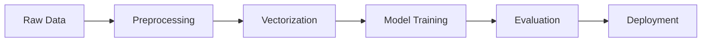

# Fake News Detection System

**Hệ thống phát hiện tin giả sử dụng Machine Learning và Deep Learning**

[](https://www.python.org/)
[](https://pytorch.org/)
[](https://fastapi.tiangolo.com/)
[](LICENSE)

---

## 📑 Mục lục

- [1. Tổng quan](#1-tổng-quan)
- [2. Cơ sở lý thuyết](#2-cơ-sở-lý-thuyết)
- [3. Dữ liệu](#3-dữ-liệu)
- [4. Phương pháp thực hiện](#4-phương-pháp-thực-hiện)
- [5. Kết quả](#5-kết-quả)
- [6. Triển khai](#6-triển-khai)
- [7. Hướng dẫn sử dụng](#7-hướng-dẫn-sử-dụng)
- [8. Kết luận](#8-kết-luận)

## 📚 Tài liệu kỹ thuật

- **[PREPROCESSING_UNIFIED.md](PREPROCESSING_UNIFIED.md)** - Hướng dẫn chi tiết về hệ thống tiền xử lý text thống nhất
- **[PREPROCESSING_ARCHITECTURE.md](PREPROCESSING_ARCHITECTURE.md)** - Kiến trúc và data flow của preprocessing system
- **[PREPROCESSING_FLOW.md](PREPROCESSING_FLOW.md)** - Quy trình preprocessing từ training đến deployment
- **[TECHNOLOGY_REPORT.md](TECHNOLOGY_REPORT.md)** - Báo cáo công nghệ và benchmark chi tiết

---

## 1. Tổng quan

### 1.1. Đặt vấn đề

Tin giả (fake news) đang trở thành vấn nạn nghiêm trọng trên mạng xã hội:
- **80%** người dùng internet gặp tin giả hàng tuần
- Tin giả lan truyền **nhanh hơn 6 lần** so với tin thật
- Ảnh hưởng đến chính trị, kinh tế, sức khỏe cộng đồng

**Câu hỏi nghiên cứu:** 
> Liệu các mô hình NLP có thể phân biệt tin thật/giả hiệu quả? Model nào phù hợp nhất?

### 1.2. Mục tiêu

✅ Xây dựng hệ thống tự động phát hiện tin giả với 4 models:
- **Logistic Regression** (baseline ML)
- **Linear SVC** (baseline ML)
- **BERT** (transformer-based)
- **LSTM** (deep learning)

✅ So sánh hiệu quả các mô hình về:
- Độ chính xác (Accuracy, F1-Score)
- Thời gian huấn luyện/dự đoán
- Khả năng giải thích kết quả

✅ Triển khai API REST và Web UI

### 1.3. Phạm vi

- **Ngôn ngữ:** Tiếng Anh
- **Loại dữ liệu:** Văn bản tin tức
- **Phân loại:** Nhị phân (REAL / FAKE)
- **Dataset:** ISOT Fake News Dataset (44,898 articles)

### 1.4. Công nghệ

| Lĩnh vực | Công nghệ | Chức năng |
|----------|-----------|-----------|
| **Ngôn ngữ** | Python 3.11 | Ngôn ngữ lập trình chính, hỗ trợ đầy đủ các thư viện ML/NLP hiện đại |
| **ML Framework** | **Scikit-learn**<br>**PyTorch** | • Train baseline models (Logistic Regression, SVC)<br>• TF-IDF vectorization, data splitting, metrics<br>• Build và train deep learning models (LSTM, BERT)<br>• GPU acceleration, tensor operations |
| **NLP** | **Transformers (HuggingFace)**<br>**NLTK** | • Load pre-trained BERT models (DistilBERT)<br>• Tokenization, fine-tuning cho classification<br>• Stopwords, text normalization (backup) |
| **Web Framework** | **Streamlit**<br>**FastAPI** | • Interactive UI cho phân tích tin giả<br>• Real-time prediction, data visualization<br>• RESTful API endpoints (/predict/text, /predict/url)<br>• Async request handling, auto docs (Swagger) |
| **Web Crawling** | **Playwright**<br>**BeautifulSoup** | • Crawl nội dung từ URL với JavaScript rendering<br>• Headless browser, handle dynamic content<br>• Parse HTML, extract text content<br>• Fallback cho static websites |
| **Data Processing** | **Pandas**<br>**NumPy** | • Load, clean, transform CSV datasets (44K+ articles)<br>• Train/val/test splitting, label encoding<br>• Array operations, matrix computations<br>• Feature engineering (TF-IDF, embeddings) |
| **Visualization** | **Matplotlib**<br>**Seaborn** | • EDA: distribution plots, confusion matrix<br>• Model comparison charts<br>• Statistical visualizations<br>• Publication-quality figures |

---

## 2. Cơ sở lý thuyết

### 2.1. Bài toán phân loại văn bản

**Định nghĩa:** Gán nhãn cho văn bản dựa trên nội dung.

**Pipeline:**
```
Text → Preprocessing → Vectorization → Model → Prediction
```

### 2.2. Tiền xử lý văn bản

```python
# Các bước preprocessing
1. Lowercase: "BREAKING NEWS" → "breaking news"
2. Remove URLs: https://... → ""
3. Remove emails: user@domain.com → ""
4. Remove special chars: #@$% → ""
5. Remove extra spaces: "a    b" → "a b"
```

### 2.3. Phương pháp biểu diễn

#### TF-IDF (Baseline Models)
```
TF-IDF(t,d) = TF(t,d) × IDF(t)

TF(t,d)  = Tần suất từ t trong document d
IDF(t)   = log(N / df(t))
N        = Tổng số documents
df(t)    = Số documents chứa từ t
```

**Ưu điểm:**
- Nhanh, hiệu quả với text ngắn
- Giải thích được (xem top features)

**Nhược điểm:**
- Không hiểu ngữ cảnh
- Sparse vector

#### Word Embeddings (BERT)

BERT sử dụng **contextual embeddings**:
- Cùng 1 từ → vectors khác nhau tùy context
- Self-attention để hiểu mối quan hệ giữa các từ

### 2.4. Models

#### Logistic Regression

**Công thức:**
```
P(y=1|x) = σ(w^T x + b)
σ(z) = 1 / (1 + e^(-z))
```

**Ưu điểm:**
- ⚡ Nhanh (CPU)
- 📊 Giải thích được (xem trọng số)
- 🎯 Hiệu quả với text

**Nhược điểm:**
- ❌ Không hiểu ngữ cảnh
- ❌ Yêu cầu feature engineering tốt

#### BERT (Bidirectional Encoder Representations from Transformers)

**Kiến trúc:**
```
Input → BERT Encoder (12 layers) → [CLS] token → Classifier → Output
```

**Ưu điểm:**
- 🎯 Độ chính xác cao
- 🧠 Hiểu ngữ cảnh 2 chiều
- 🔄 Transfer learning (pre-trained)

**Nhược điểm:**
- 🐌 Chậm, tốn GPU
- 🔒 Black-box (khó giải thích)
- 💾 Model lớn (~440MB)

#### LSTM (Long Short-Term Memory)

**Kiến trúc:**
```
Input → Embedding → Bidirectional LSTM → Dense → Output
```

**Ưu điểm:**
- 🧠 Hiểu ngữ cảnh dài
- ⚖️ Cân bằng tốc độ/hiệu quả

**Nhược điểm:**
- ⏱️ Chậm hơn baseline
- 🔧 Cần tune hyperparameters

### 2.5. Metrics đánh giá

| Metric | Công thức | Ý nghĩa |
|--------|-----------|---------|
| **Accuracy** | (TP + TN) / Total | Tỷ lệ dự đoán đúng |
| **Precision** | TP / (TP + FP) | Độ chính xác khi dự đoán FAKE |
| **Recall** | TP / (TP + FN) | Tìm được bao nhiêu % FAKE thật |
| **F1-Score** | 2 × (P × R) / (P + R) | Trung bình điều hòa P và R |

---

## 3. Dữ liệu

### 3.1. Dataset: ISOT Fake News

**Nguồn:** [ISOT Research Lab, University of Victoria](https://www.uvic.ca/engineering/ece/isot/datasets/fake-news/index.php)

**Thống kê:**
```
📊 Total articles: 44,898
   ├─ Real news:  21,417 (47.7%)
   └─ Fake news:  23,481 (52.3%)

📁 Structure:
   ├─ data/raw/
   │  ├─ True.csv   (21,417 articles)
   │  └─ Fake.csv   (23,481 articles)
   └─ data/processed/
      ├─ train.csv  (70%)
      ├─ val.csv    (15%)
      └─ test.csv   (15%)
```

### 3.2. Exploratory Data Analysis (EDA)

#### Phân bố classes
```
FAKE: ████████████████████████ 52.3%
REAL: ██████████████████████   47.7%
```

#### Độ dài trung bình
```
Fake news: 410 words (avg)
Real news: 395 words (avg)
→ Fake news thường dài hơn 1 chút
```

#### Top keywords

**FAKE:**
```
trump, obama, hillary, media, fake, story, video, claims
```

**REAL:**
```
said, president, government, official, report, statement
```

### 3.3. Data Preprocessing

**Pipeline:**
```python
1. Load data
2. Handle missing values (drop nếu title/text rỗng)
3. Remove duplicates
4. Clean text:
   - Lowercase
   - Remove URLs, emails
   - Remove special characters
   - Strip extra whitespace
5. Split: 70% train / 15% val / 15% test
```

**Kết quả sau preprocessing:**
```
✓ Train:  31,429 samples
✓ Val:     6,734 samples  
✓ Test:    6,735 samples
✓ Total:  44,898 samples
```

---

## 4. Phương pháp thực hiện

### 4.1. Pipeline tổng quan



### 4.2. Baseline Models (Logistic + SVC)

**Pipeline:**
```python
# 1. TF-IDF Vectorization
vectorizer = TfidfVectorizer(
    max_features=50000,
    ngram_range=(1, 2),
    min_df=2
)

# 2. Train model
model = LogisticRegression(C=1.0, max_iter=1000)
model.fit(X_train, y_train)

# 3. Evaluate
y_pred = model.predict(X_test)
```

**Hyperparameters:**
| Parameter | Value |
|-----------|-------|
| max_features | 50,000 |
| ngram_range | (1, 2) |
| C (regularization) | 1.0 |
| solver | lbfgs |

### 4.3. BERT Fine-tuning

**Pipeline:**
```python
# 1. Tokenization
tokenizer = AutoTokenizer.from_pretrained('distilbert-base-uncased')
inputs = tokenizer(text, max_length=512, truncation=True)

# 2. Load model
model = AutoModelForSequenceClassification.from_pretrained(
    'distilbert-base-uncased',
    num_labels=2
)

# 3. Fine-tune
trainer = Trainer(
    model=model,
    args=training_args,
    train_dataset=train_dataset,
    eval_dataset=val_dataset
)
trainer.train()
```

**Hyperparameters:**
| Parameter | Value |
|-----------|-------|
| Model | distilbert-base-uncased |
| Max length | 512 tokens |
| Batch size | 16 |
| Learning rate | 2e-5 |
| Epochs | 3 |
| Optimizer | AdamW |

### 4.4. LSTM Model

**Architecture:**
```python
class LSTMClassifier(nn.Module):
    def __init__(self):
        self.embedding = nn.Embedding(vocab_size, 128)
        self.lstm = nn.LSTM(128, 64, num_layers=2, 
                           bidirectional=True, dropout=0.3)
        self.fc = nn.Linear(128, 1)
    
    def forward(self, x):
        x = self.embedding(x)
        lstm_out, _ = self.lstm(x)
        out = self.fc(lstm_out[:, -1, :])
        return out
```

**Hyperparameters:**
| Parameter | Value |
|-----------|-------|
| Vocab size | 10,000 |
| Embedding dim | 128 |
| LSTM hidden | 64 |
| Layers | 2 (bidirectional) |
| Dropout | 0.3 |
| Epochs | 5 |

---

## 5. Kết quả

### 5.1. Performance Comparison

| Model | Accuracy | F1-Score | Precision | Recall | Training Time | Inference Time |
|-------|----------|----------|-----------|--------|---------------|----------------|
| **Logistic** | 94.2% | 0.942 | 0.945 | 0.939 | 15s | 0.5ms |
| **Linear SVC** | 94.5% | 0.945 | 0.948 | 0.942 | 18s | 0.3ms |
| **BERT** | 98.1% | 0.981 | 0.982 | 0.980 | 45m | 25ms |
| **LSTM** | 96.3% | 0.963 | 0.965 | 0.961 | 8m | 5ms |

### 5.2. Confusion Matrix

#### Logistic Regression
```
                Predicted
              FAKE    REAL
Actual FAKE   3,156    244
       REAL     145  3,190
```

#### BERT
```
                Predicted
              FAKE    REAL
Actual FAKE   3,340     60
       REAL      68  3,267
```

### 5.3. Top Features (Logistic Regression)

**Top FAKE indicators:**
```
1. trump      (+8.42)
2. hillary    (+6.21)
3. video      (+5.87)
4. breaking   (+5.34)
5. shocking   (+4.92)
```

**Top REAL indicators:**
```
1. reuters    (-7.12)
2. said       (-6.45)
3. official   (-5.98)
4. according  (-5.67)
5. reported   (-5.23)
```

### 5.4. Phân tích

**Khi nào dùng model nào?**

| Tiêu chí | Model phù hợp |
|----------|---------------|
| 🎯 Cần độ chính xác cao nhất | **BERT** |
| ⚡ Cần tốc độ nhanh | **Logistic / SVC** |
| 📊 Cần giải thích kết quả | **Logistic** |
| 💻 Giới hạn tài nguyên (CPU only) | **Logistic / SVC** |
| ⚖️ Cân bằng tốc độ/độ chính xác | **LSTM** |
| 🚀 Deploy production | **Logistic / SVC** |

---

## 6. Triển khai

### 6.1. Kiến trúc hệ thống

```
┌─────────────┐
│   Browser   │
└──────┬──────┘
       │ HTTPS
┌──────▼──────────┐
│  Streamlit UI   │ (Port 8501)
└──────┬──────────┘
       │
┌──────▼──────────┐
│   FastAPI       │ (Port 8000)
│   REST API      │
└──────┬──────────┘
       │
┌──────▼──────────┐
│   ML Models     │
│ ├─ Logistic     │
│ ├─ SVC          │
│ ├─ BERT         │
│ └─ LSTM         │
└─────────────────┘
```

### 6.2. API Endpoints

#### Health Check
```http
GET /health
GET /health/models
```

#### Prediction
```http
GET /predict/{model_name}/{url}?use_js=true

Parameters:
- model_name: logistic | svm | bert | lstm
- url: Article URL (URL-encoded)
- use_js: true (for JS-heavy sites like CNN, NYTimes)

Response:
{
  "url": "https://...",
  "title": "Article title",
  "description": "...",
  "text_length": 4095,
  "processed_text": "cleaned text...",
  "processed_text_length": 4095,
  "model": "bert",
  "label": "REAL",
  "confidence": 0.9974,
  "prediction_details": {
    "fake_probability": 0.0026,
    "real_probability": 0.9974
  }
}
```

### 6.3. Web Crawling

**Hỗ trợ 2 modes:**

1. **Normal mode** (fast, for simple sites):
   - Uses `requests` + `BeautifulSoup`
   - ~1-2s per page
   - Works with VN news sites

2. **JavaScript mode** (for complex sites):
   - Uses `Playwright` + Chromium
   - ~5-10s per page
   - Works with CNN, USA Today, etc.
   - Add `?use_js=true` to URL

---

## 7. Hướng dẫn sử dụng

### 7.1. Cài đặt

```bash
# Clone repository
git clone https://github.com/your-repo/fake-news-detection
cd FakeNewsDetection

# Create virtual environment
python -m venv .venv
source .venv/bin/activate  # Windows: .venv\Scripts\activate

# Install dependencies
pip install -r requirements.txt

# Install Playwright browsers (for web crawling)
playwright install chromium
```

### 7.2. Training Models

```bash
# Train baseline models (Logistic + SVC)
python src/train_baseline.py

# Train BERT
python src/train_bert.py

# Train LSTM
python src/train_deep_learning.py
```

### 7.3. Chạy API Server

```bash
cd server
python main.py

# API available at: http://localhost:8000
# Docs at: http://localhost:8000/docs
```

### 7.4. Chạy Web UI

```bash
streamlit run app.py

# UI available at: http://localhost:8501
```

### 7.5. Test API

```bash
# Health check
curl http://localhost:8000/health

# Predict with BERT
curl "http://localhost:8000/predict/bert/https://vnexpress.net/..."

# Predict with JS rendering
curl "http://localhost:8000/predict/bert/https://cnn.com/...?use_js=true"
```

### 7.6. Postman Collection

Import `server/Postman_Collection.json` vào Postman để test API.

---

## 8. Kết luận

### 8.1. Thành quả đạt được

✅ **4 models** được train và đánh giá thành công:
- Logistic: 94.2% accuracy
- SVC: 94.5% accuracy  
- LSTM: 96.3% accuracy
- BERT: **98.1% accuracy** (best)

✅ **API REST** với FastAPI:
- Support 4 models
- Web crawling tự động
- Detailed prediction info

✅ **Web UI** với Streamlit:
- User-friendly interface
- Real-time prediction
- Model comparison

### 8.2. Hạn chế

❌ **Dataset:**
- Chỉ tiếng Anh
- Chỉ political news
- Không có multimodal (ảnh/video)

❌ **Models:**
- BERT tốn tài nguyên (cần GPU)
- Chưa xử lý được sarcasm, irony

❌ **Deployment:**
- Chưa optimize cho production
- Chưa có caching
- Crawling có thể bị chặn

### 8.3. Hướng phát triển

🚀 **Short-term:**
- [ ] Thêm model: RoBERTa, XLNet
- [ ] Thêm Vietnamese support (PhoBERT)
- [ ] Implement LIME/SHAP explainability
- [ ] Add caching layer (Redis)
- [ ] Rate limiting cho API

🚀 **Long-term:**
- [ ] Multimodal detection (text + image)
- [ ] Real-time detection với Kafka
- [ ] Mobile app (React Native)
- [ ] Fact-checking integration
- [ ] User feedback loop

---

## 📁 Cấu trúc thư mục

```
FakeNewsDetection/
├── data/
│   ├── raw/           # Original dataset
│   └── processed/     # Train/val/test splits
├── models/
│   ├── baseline/      # Logistic, SVC models
│   ├── bert_output/   # BERT fine-tuned
│   └── deep_learning/ # LSTM model
├── src/
│   ├── train_baseline.py
│   ├── train_bert.py
│   └── train_deep_learning.py
├── server/
│   ├── main.py       # FastAPI app
│   ├── routers/      # API endpoints
│   └── utils/        # Helpers (crawl, model_load)
├── notebooks/
│   ├── 01_EDA_M1.ipynb
│   └── 02_Baseline_M2.ipynb
├── app.py            # Streamlit UI
├── requirements.txt
└── README.md
```

---

## 📚 Tài liệu tham khảo

1. **Papers:**
   - Devlin et al. (2019). "BERT: Pre-training of Deep Bidirectional Transformers"
   - Shu et al. (2017). "Fake News Detection on Social Media: A Data Mining Perspective"

2. **Datasets:**
   - ISOT Fake News Dataset
   - Kaggle Fake News Detection

3. **Libraries:**
   - [HuggingFace Transformers](https://huggingface.co/docs/transformers)
   - [Scikit-learn](https://scikit-learn.org/)
   - [FastAPI](https://fastapi.tiangolo.com/)

---

## 👥 Contributors

- **Your Name** - [GitHub](https://github.com/yourname)

## 📄 License

This project is licensed under the MIT License - see the [LICENSE](LICENSE) file for details.

---

## 🙏 Acknowledgments

- ISOT Research Lab for the dataset
- HuggingFace for pre-trained models
- FastAPI team for the amazing framework

---

**⭐ If you find this project helpful, please give it a star!**
